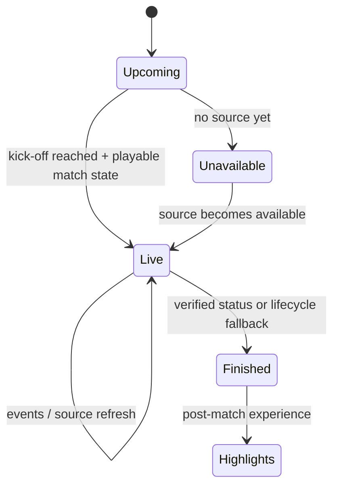
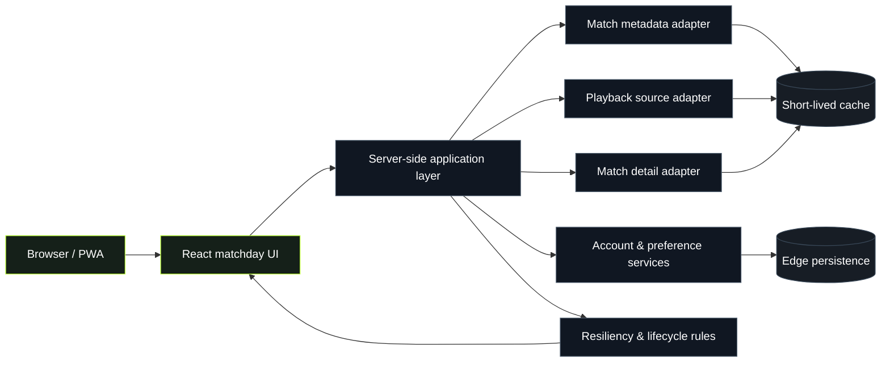

<div align="center">

# NINETY

### A modern football matchday experience built for the web

Fast match discovery, live-state handling, resilient playback UX, match events, lineups, saved matches, reminders, and polished post-match flows — in one responsive interface.


</div>

---

## Overview

**NINETY** is a personal football matchday project focused on making live and upcoming fixtures easy to discover and pleasant to follow across desktop and mobile.

The application is designed around real match states rather than a static list of links. A fixture can move through **upcoming → live → finished**, with the interface adapting automatically at each stage.

The project also treats external data and playback availability as unreliable inputs. Provider failures, missing lineups, stale statuses, unavailable sources, and completed broadcasts are handled as explicit product states instead of uncaught errors.

> **Project note:** NINETY is a personal learning project. Playback is intended only for sources the operator is authorized to use. This repository does not document private provider credentials, internal access configuration, or deployment secrets.

---

## Product highlights

### Match discovery

- All, Live, Today, Upcoming, Favorites, and personal matchday views
- Fast team and competition search
- Featured fixtures and live-match ticker
- Grid and compact layouts
- Responsive desktop and mobile experience
- Team badges with graceful fallbacks
- Saved matches, preferred teams, and reminders

### Matchday experience

- Upcoming-match countdowns
- Live-state detection with stale-status safeguards
- Multiple-source selection when more than one authorized source is available
- Playback recovery controls
- Cinema and fullscreen viewing modes
- Offline and unavailable-source states
- User-controlled rejection of an incorrect broadcast source
- Automatic re-checking when no usable source is available

### Match center

- Match Events shown first during live fixtures
- Live timeline refresh behavior for goals, cards, VAR, and substitutions when data is available
- Starting lineups loaded **only when requested**
- Confirmed-XI display with team formations and player imagery when available
- Quota-aware provider failure states
- No invented lineups or scores

### Full-time experience

- Finished matches automatically leave Live surfaces
- Final-score presentation when a verified result is available
- Independent result fallback when the primary match-data service is unavailable
- Final event timeline
- Confirmed lineups remain accessible
- YouTube highlights discovery after full time
- Dedicated finished-match presentation instead of a dead player

---

## Experience states

NINETY deliberately models the full lifecycle of a football fixture.



The application does not assume that every upstream status is current. Local lifecycle safeguards prevent stale provider data from leaving already-finished matches marked as live indefinitely.

---

## High-level architecture

The public documentation intentionally stays at a high level. Provider credentials, internal source identifiers, authentication secrets, operational endpoints, and infrastructure-specific configuration are not documented here.



### Design principles

- **Server-side provider access** — external service calls and credentials stay away from client code.
- **Graceful degradation** — a metadata outage should not automatically break the rest of the match page.
- **Explicit lifecycle rules** — live and ended states are not based on a single unreliable signal.
- **Demand-driven data** — expensive data such as lineups is requested only when the user opens it.
- **Defensive caching** — live information uses shorter caching while stable post-match information can be retained longer.
- **No fabricated sports data** — missing scores, lineups, or events remain unavailable rather than being guessed.

---

## Tech stack

| Area | Technology |
| --- | --- |
| UI | React 19, TypeScript |
| Application framework | Vinext / Vite |
| Runtime | Cloudflare Workers |
| Styling | Application-level responsive CSS |
| UI primitives | Base UI, Radix-compatible components |
| Persistence | Cloudflare edge primitives |
| Validation | Zod |
| Testing | Node test runner + targeted integration tests |
| Package manager | pnpm |

The README intentionally does **not** list external match/playback providers or credential names. Those are implementation details and may change independently of the product.

---

## Repository layout

A simplified map of the project:

```text
app/
├── api/                  Server-side application endpoints
├── watch/                Match watching + match-center experience
├── match-lifecycle.ts    Upcoming / live / finished safeguards
├── account-storage.ts    Account-aware preference synchronization
├── page.tsx              Main match discovery experience
└── globals.css           Responsive visual system

components/
└── ui/                   Shared interface primitives

public/                    Static application assets
scripts/                   Build and development helpers
tests/                     Focused behavior and integration tests
```

Some operational and provider-specific implementation details are intentionally omitted from this overview.

---

## Local development

### Requirements

- Node.js 22.13+
- pnpm 11

Install dependencies:

```bash
pnpm install --frozen-lockfile
```

Run the development server:

```bash
pnpm dev
```

Create a production build:

```bash
pnpm build
```

Run the focused automated tests:

```bash
node --test tests/*.test.mjs
```

### Environment configuration

Runtime credentials and private configuration belong in the deployment environment — **never in source control**.

This README intentionally does not provide:

- production credentials
- API keys or tokens
- session secrets
- friend/guest credentials
- provider-specific identifiers
- internal admin URLs
- private infrastructure bindings

Use local development values or your deployment platform's encrypted secret management.

---

## Reliability and safety

NINETY assumes that external services can be delayed, incomplete, rate-limited, stale, or temporarily unavailable.

Examples of defensive behavior include:

- cached responses to reduce unnecessary upstream requests
- live-data polling only while relevant UI is active
- browser-visibility awareness
- lifecycle fallbacks for stale match status
- verified-score fallback rather than fabricated results
- complete starting XI requirement before rendering lineups
- source rejection and replacement checks when a user identifies an incorrect broadcast
- graceful unavailable states instead of broken player surfaces

### Security posture

The public repository should explain **what the application does**, not provide a map for attacking a deployment.

Accordingly, documentation avoids publishing:

- secrets or example production credentials
- detailed authentication internals
- exact rate-limit thresholds
- production storage identifiers
- privileged operational routes
- provider request formats and private source mappings
- internal monitoring implementation
- infrastructure account identifiers

Security-sensitive operational documentation should remain private.

If you discover a security issue, please report it privately rather than opening a public issue containing exploit details.

---

## Screenshots & demo media

The visual experience is a major part of NINETY, but repository media should be **sanitized before publishing**.

Recommended public media set:

1. **Homepage** — desktop match discovery with Live / Today / Upcoming states.
2. **Mobile homepage** — responsive cards and navigation.
3. **Upcoming match** — countdown and matchday warm-up state.
4. **Live match center** — use a controlled/demo fixture; avoid publishing third-party broadcast footage.
5. **Full-time screen** — final score and highlights CTA.
6. **Short GIF** — search → match card → match page → match-center navigation.

For screenshots or recordings, crop out browser profiles, account names, private URLs, developer tools, tokens, request headers, admin pages, provider names, and any third-party video content you do not have permission to redistribute.

A short GIF is preferable to embedding a large video directly in Git. If a longer demo is needed, host it separately and link to it from this section.

---

## Current focus

The project is actively evolving around:

- more resilient match-state detection
- improved live-event availability
- better source-quality recovery
- richer post-match presentation
- mobile polish
- owner-only operational tooling kept separate from public-facing product documentation

---

## Usage & rights

NINETY does not grant rights to third-party broadcasts, logos, sports data, or media.

Use of any external source must comply with the applicable provider terms, copyright requirements, embedding permissions, and distribution rights.

This repository contains application code for a personal project and is **not an authorization to redistribute protected content**.

---

## License

**All rights reserved.**

No open-source license is granted unless a separate license file explicitly states otherwise.
