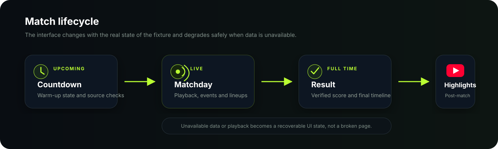
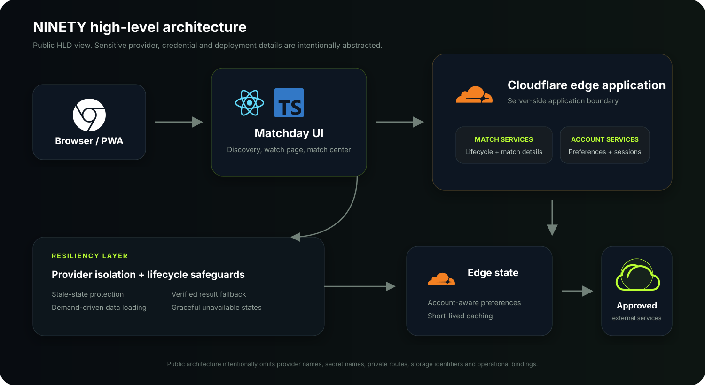

<div align="center">

# NINETY

### A modern football matchday experience for the web

A responsive football application built around the full match journey — discovering fixtures, following live matches, checking events and lineups, and moving naturally into the post-match experience.


</div>

---

## About NINETY

I built NINETY because I wanted a football matchday experience that felt alive rather than a static list of fixtures.

A match changes throughout the day, and the product should change with it. NINETY is designed around that journey: **upcoming → live → finished → post-match**. The interface adapts as the fixture changes while keeping the experience focused and consistent across desktop and mobile.

The project also assumes that real-world data is imperfect. Information can arrive late, become temporarily unavailable, or disagree with another signal. Instead of allowing those situations to break the interface, NINETY treats them as normal product states and degrades gracefully.

<p align="center">
  
</p>

<p align="center">
  
</p>

---

## What it does

- Discover **live, today, upcoming, saved, and favorite** fixtures
- Search for teams and competitions
- Follow match status as fixtures move from upcoming to live and finished
- View match events and confirmed lineup information when available
- Save matches and teams for quicker access
- Use reminders and matchday-focused navigation
- Present useful post-match information after full time
- Adapt cleanly between desktop and mobile
- Handle missing or delayed information without inventing match data
- Provide clear loading, unavailable, offline, and recovery states

The goal is not to display every possible piece of football data. It is to make the information that matters during a matchday easy to find and pleasant to use.

---

## Match lifecycle

The fixture lifecycle is one of the core ideas behind NINETY. Upcoming, live, finished, and post-match states are treated as distinct product experiences rather than variations of the same page.

<p align="center">
  
</p>

The application uses defensive lifecycle rules so incomplete or stale upstream information does not automatically dictate what the user sees.

---

## Architecture

NINETY separates the browser-facing experience from server-side integration and application logic. External dependencies are normalized behind application boundaries so the UI can work with a consistent model instead of being tightly coupled to individual services.

<p align="center">
  
</p>

At a high level, the design emphasizes:

- **Clear trust boundaries** between the client and server-side integrations
- **Normalized application data** instead of provider-specific behavior leaking into the UI
- **Graceful degradation** when an external dependency is unavailable
- **Lifecycle-aware state** for upcoming, live, and completed fixtures
- **Demand-driven loading** for information that is not needed immediately
- **Defensive caching** appropriate to how quickly different match information changes
- **No fabricated sports data** when information cannot be verified

The public architecture intentionally stays at this level. Provider mappings, credentials, authentication internals, operational controls, infrastructure identifiers, request formats, and other security-sensitive implementation details are not documented publicly.

---

## Tech stack

| Area | Technology |
| --- | --- |
| Frontend | React 19, TypeScript |
| Build / application layer | Vite / Vinext |
| Runtime | Cloudflare Workers |
| Validation | Zod |
| UI | Responsive application CSS and reusable components |
| Testing | Node-based automated and integration tests |
| Package management | pnpm |

The specific external services behind match data and other integrations are intentionally treated as replaceable implementation details.

---

## Engineering priorities

### Reliability

NINETY is designed with the assumption that external dependencies can be delayed, incomplete, stale, rate-limited, or temporarily unavailable. The application therefore favors explicit fallback states, bounded retries, sensible caching, and recovery behavior over brittle happy-path assumptions.

### Performance

The interface avoids loading everything at once. Data is requested according to the part of the experience the user is actually viewing, while stable information can be reused where appropriate. This keeps the matchday experience responsive without unnecessary work.

### Data integrity

Scores, lineups, events, and match states are never invented to fill a gap. If information cannot be verified, the interface communicates that state instead.

### Security

Sensitive operations stay behind server-side boundaries. Secrets and private configuration belong in the deployment environment, not client code or public documentation.

This repository deliberately does **not** publish production credentials, authentication design details, private routes, provider request formats, operational thresholds, storage identifiers, privileged tooling, or deployment internals.

---

## Development

### Requirements

- Node.js 22.13+
- pnpm 11

```bash
pnpm install --frozen-lockfile
pnpm dev
```

Production build:

```bash
pnpm build
```

Run the focused automated tests:

```bash
node --test tests/*.test.mjs
```

Runtime secrets and environment-specific configuration must be supplied through the deployment environment and should never be committed to source control.

---

## Current direction

NINETY is actively evolving around match-state reliability, richer matchday context, post-match presentation, performance, and continued desktop/mobile polish.

It is a personal engineering project, but I approach it like a real product: build the useful path, expect dependencies to fail, make recovery understandable, test the behavior that matters, and keep refining the experience.

---

## Usage & rights

NINETY does not grant rights to third-party broadcasts, logos, sports data, or media. Any external source used with the application must be used in accordance with the applicable provider terms, permissions, and distribution rights.

This repository contains application code for a personal project and does not authorize redistribution of protected third-party content.

---

## License

**All rights reserved.**

No open-source license is granted unless a separate license file explicitly states otherwise.
